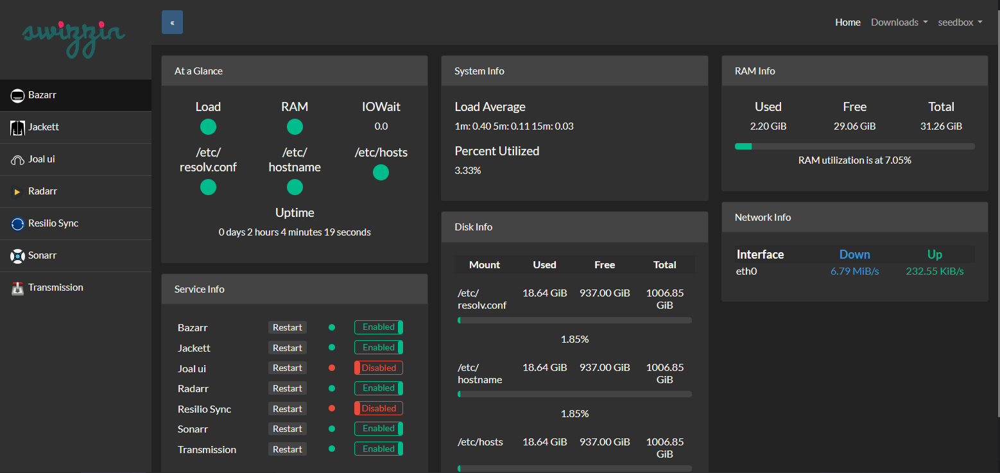
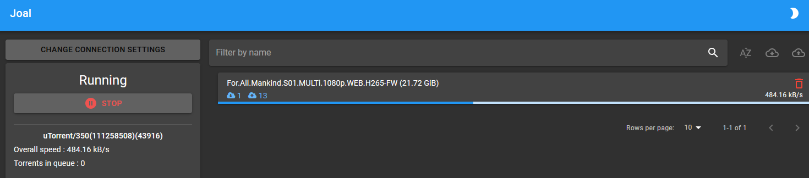

# Dockerized Swizzin, Joal, and Resilio Sync

This repository provides a Dockerized setup for running **Swizzin**, a seedbox management suite, **Joal (Just Another Leecher)**, a lightweight torrent seeder tool, and **Resilio Sync**, a robust file synchronization solution. This setup simplifies deployment and ensures a consistent environment for all services.

---

## Features

### Swizzin

See docs: [https://swizzin.ltd/getting-started](https://swizzin.ltd/getting-started)

- Manage seedbox services like Deluge, qBittorrent, Plex, and more.
- Web-based user panel for controlling installed applications.
- Easy management of torrents, users, and system updates.

### Joal

- A lightweight, customizable seeding tool.
- Fakes upload statistics for torrents.
- Includes a web UI for easy configuration.

### Resilio Sync

- Efficient peer-to-peer file synchronization tool.
- Handles large file transfers with ease.
- Integrated into the Docker setup as Swizzin does not manage it well.

---

## Requirements

- Docker (version 20.10 or newer)
- Docker Compose (version 1.29 or newer)

---

## Project Structure

```
└── 📁seedbox
    └── 📁joal
        └── 📁clients
        └── 📁torrents
        └── config.json
    └── docker-compose.yml
    └── Dockerfile
    └── README.md
```

---

## Setup

### 1. Clone the Repository

```bash
git clone https://github.com/valentinmaxime/dockerised-swzzin.git
cd docker-swizzin-joal
```

### 2. Configure Environment Variables and Docker

#### Swizzin Configuration
Edit the `Dockerfile` to set up necessary configurations for Swizzin:

```bash
# Swizzin Settings
ENV SEEDBOX_USER="seedbox"
ENV SEEDBOX_PASS="test_password"
```

Change the package list as you want:

```bash
RUN curl -sL git.io/swizzin | bash -s -- --unattend nginx panel transmission radarr lidarr --user $SEEDBOX_USER --pass $SEEDBOX_PASS
```

**Note**: The order of packages is important. See [https://swizzin.ltd/guides/advanced-setup](https://swizzin.ltd/guides/advanced-setup).

#### Docker Compose Configuration
Edit the `docker-compose.yml` to set up necessary configurations for Swizzin (change username if needed):

```yml
volumes:
  - ./data/downloads:/home/seedbox/transmission/downloads
  - ./data/torrents:/home/seedbox/transmission/watch
```

Edit the `docker-compose.yml` to set up necessary configurations for Joal (prefix and secret token):

```bash
# Joal Settings
command: ["--joal-conf=/data", "--spring.main.web-environment=true", "--server.port=8003", "--joal.ui.path.prefix=OP", "--joal.ui.secret-token=SC"]
```

Edit the `config.json` to set up necessary configurations for Joal:

```json
{
  "minUploadRate": 30,
  "maxUploadRate": 308,
  "simultaneousSeed": 5,
  "client": "utorrent-3.5.0_43916.client",
  "keepTorrentWithZeroLeechers": true
}
```


### 3. Setup VPN Container

Current configuration uses Private Internet Access VPN. You can change the provider (see [Gluetun Wiki](https://github.com/qdm12/gluetun-wiki/tree/main/setup/providers)).

Set your account settings in `docker-compose.yml`:

```yml
  - OPENVPN_USER=pXXXXXX
  - OPENVPN_PASSWORD=password
```

### 4. Build Swizzin Docker Image

```bash
docker build -t swizzin .
```

### 5. Build and Start the Services

Use Docker Compose to build and start the services:

```bash
docker-compose up -d
```

This will:
- Launch Swizzin in a container.
- Launch Joal alongside it.
- Launch Resilio Sync alongside it.
- Setup VPN configuration.

### 6. Access the Services

- **Swizzin Web Panel**: [http://your-server-ip](http://your-server-ip)
  
- **Joal Web UI**: [http://your-server-ip/OP/ui:8003](http://your-server-ip/OP/ui:8003)
  **To configure Joal UI, click on `change connection settings` and click `save`.**
  
- **Resilio Sync Web UI**: [http://your-server-ip:8888](http://your-server-ip:8888)
- **Resilio Sync** [http://your-server-ip:8888](http://your-server-ip:8888)
Resilio Sync is included as Swizzin does not manage it well.

---

## Customization

### Swizzin Configuration
Swizzin can be customized to include additional services like qBittorrent, Plex, or Deluge. Modify the Swizzin installation script in `Dockerfile` or extend the Swizzin configuration via the web panel.

### Joal Configuration
1. Use the `JOAL_CONFIG_URL` environment variable to specify a custom `joal-config.json`.
2. Place the `joal-config.json` file in `./data/joal` for direct customization.

Example `joal-config.json`:

```json
{
  "minUploadRate": 50,
  "maxUploadRate": 1000,
  "files": ["/data/torrents"]
}
```

### Resilio Sync Configuration
You can customize Resilio Sync by editing the `./data/sync` directory and configuring folders and peers using its Web UI.

---

## Security Recommendations

- Use strong passwords for the Swizzin panel.
- Secure the Joal `SECRET` to prevent unauthorized access.
- Use a reverse proxy (e.g., NGINX or Traefik) to enable HTTPS for secure communication.

---

## Improvements / Future Updates

### Planned Enhancements

- **Settings**: Add some Joal settings in configurable env variables.
- [x] **Network**: Add VPN integration.
- [x] **Docker**: Change Ubuntu to Debian.
- [ ] **SSL Integration**: Automate HTTPS setup using Let's Encrypt or other SSL providers.
- [ ] **Improved Documentation**: Provide more detailed usage examples and FAQs.
- [ ] **Multi-User Support**: Enhance Swizzin configuration to better support multiple users with isolated environments.
- [ ] **CI/CD Pipelines**: Automate build and deployment processes with GitHub Actions or similar tools.

---

### Community Contributions

- Contributions to extend functionality or fix issues are welcome.
- Please open a pull request or issue for discussions.

---

## Contributing

Feel free to open issues or submit pull requests to improve this setup.

---

## License

This project is licensed under the MIT License. See the [LICENSE](LICENSE) file for details.

